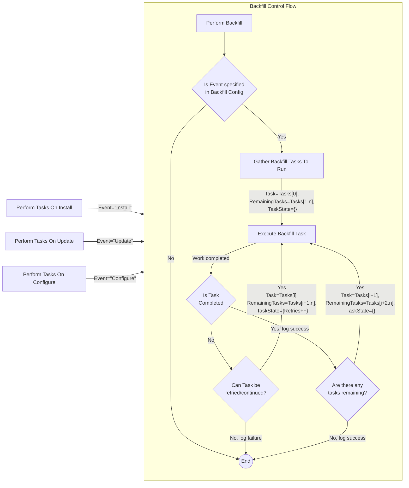

# Backfill process

## Trigger onInstall|onUpdate|onConfigure

- Check backfill config, and that INSTALL|UPDATE|CONFIGURE event should trigger the process. Exit if not.
- Initialize list of tasks to queue.
  If "AUTH" is in sources, push task details to trigger addExistingUsersToList
  For "MERGE_FIELDS" | "MEMBER_TAGS" | "MEMBER_EVENTS", find the collection paths, and build a task like:
  [{
  sources: ["MERGE_FIELDS", "MEMBER_TAGS"],
  collectionPath: "doc/fields/and/tags"
  }
  {
  sources: ["MEMBER_EVENTS"],
  collectionPath: "doc/events"
  }]

Trigger the first task, passing through the first task state (mostly empty) and the remaining tasks.
The first task should be able to requeue itself as needed for paging, retries etc using its state, and then

Task dependency - if users don't exist in Mailchimp:

1. "AUTH" will work
2. "MERGE_FIELDS" will work
3. "MEMBER_TAGS" won't work
4. "MEMBER_EVENTS" won't work

